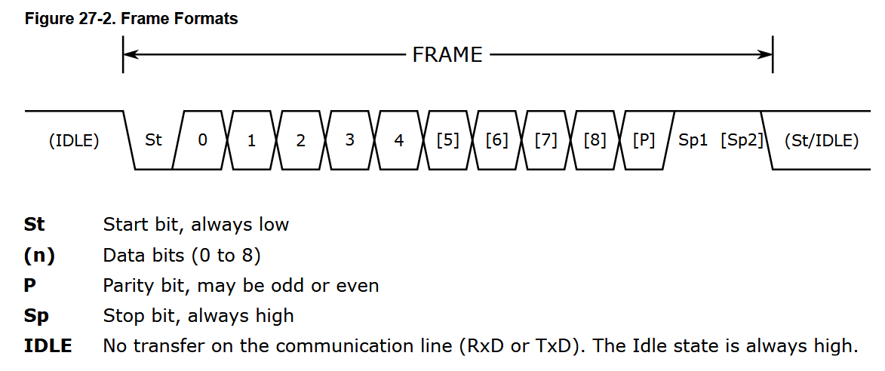
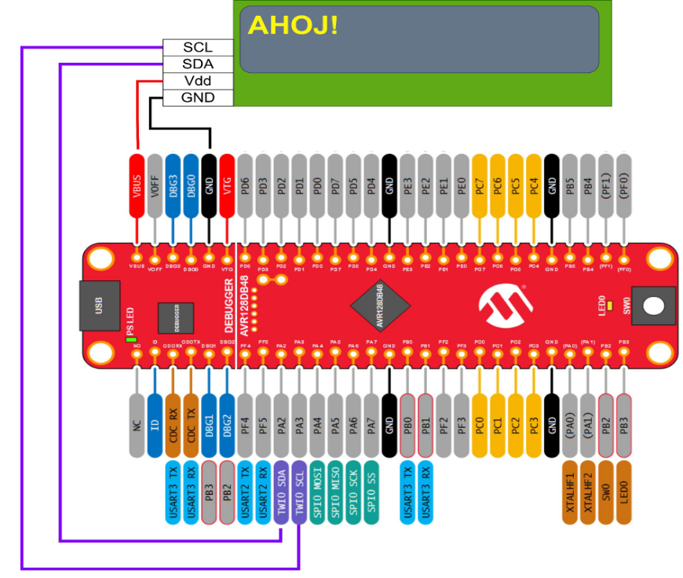

# 🚀 REV - Šesté cvičení - UART

UART (Universal asynchronous receiver-transmitter) je jedna z komunikačních sběrnic. Na EduKitu je spojena s programatorem, který zajišťuje převod na USB. To, že je sběrnice asynchronní znamená, že není použit synchronizační signál např. společný clock. Periferie odesílá jeden bajt, který je uveden start a ukončen stop bitem. Případně lze přidat paritní bit.Jak je patrné na následujícím obrázku jedná se o dvojici linek, které odesílají TX a příjmají RX zprávu. Při konfiguraci je třeba nastavit rychlost přenosu v Baudech. 

<p align="center">
  
</p>



## 🏗️  Příklad 6.1:

- příjem a odeslání znaku
  
```c

#include <avr/io.h>
#include <avr/interrupt.h>
#include <stdio.h>

#define F_CPU 24000000UL
#include <util/delay.h>

#define BAUDRATE 115200UL


void uart_init(uint32_t f_cpu, uint32_t baud)
{
    // nastaveni pinu TX RX
    PORTB.DIRSET = PIN0_bm;   
    PORTB.DIRCLR = PIN1_bm;   

    // baudrate str. 380
    USART3.BAUD  = (uint16_t)((f_cpu * 4UL) / baud);
   // zapnuti TX a RX       
    USART3.CTRLB |= USART_TXEN_bm | USART_RXEN_bm;
}

void uart_transmit(uint8_t data) {
    // cekam na misto v tx bufferu
    while (!(USART3.STATUS & USART_DREIF_bm));
    USART3.TXDATAL = data;
}

uint8_t uart_receive(void) {
    // cekam na priznak ze RX buffer ma data
    while (!(USART3.STATUS & USART_RXCIF_bm));
    return USART3.RXDATAL;
}

int main(void) {
    
    // osci na 24MHz
    _PROTECTED_WRITE(CLKCTRL_OSCHFCTRLA, CLKCTRL_FRQSEL_24M_gc);
    
    // nastaveni uartu ve fci
    uart_init(F_CPU, BAUDRATE);
           
    while (1)
    {
        // Echo:
        uint8_t received_byte = uart_receive();
        uart_transmit(received_byte);

    }
}


```

##  🏗️ Příklad 6.2:
- vyvolání přerušení na  příchod znaku
```c
#include <avr/io.h>
#include <avr/interrupt.h>
#include <stdio.h>
#include <string.h>

#define F_CPU 24000000UL
#include <util/delay.h>

#define BAUDRATE 115200UL

ISR(USART3_RXC_vect)
{   
    uint8_t received_char = USART3.RXDATAL;
    
    while (!(USART3.STATUS & USART_DREIF_bm));
    USART3.TXDATAL = received_char;
   
}

void uart_init(uint32_t f_cpu, uint32_t baud)
{
    // nastaveni pinu TX RX
    PORTB.DIRSET = PIN0_bm;   
    PORTB.DIRCLR = PIN1_bm;

    // baudrate str. 380
    USART3.BAUD  = (uint16_t)((f_cpu * 4UL) / baud);\
    // zapnuti TX a RX        
    USART3.CTRLB |= USART_TXEN_bm | USART_RXEN_bm;
    // zapnuti RX interrupt
    USART3.CTRLA = USART_RXCIE_bm;
}

int main(void) {
    
    _PROTECTED_WRITE(CLKCTRL_OSCHFCTRLA, CLKCTRL_FRQSEL_24M_gc);
            
    uart_init(F_CPU, BAUDRATE);

    sei();
    
    while (1)
    {

    }
}
```

## 💡 Použutí displeje:

Ve složce různe jsou soubory LCD.c LCD.h. Ty můžete zahrnout do projeku a pak používat displej. 



## 📝 Zadání:

1) Vyzkoušejte ukázky 6.1 a 6.2. Je třeba nějáky prográmek pro příjem např. termite - odkaz na hlavni stránce github projektu. Nastavte rychlost přenosu. Dále je třeba zapnout DTR/DSR. 

2) Vytvořte funkci pro odeslání řetězce až do nulového znaku.
    
   ```
   void usart_write_str(const char *s);   // vypise retezec az do nuloveho znaku
   ```
   
3) Společně s funkcemi z 2. vytvořte knihovnu “Uart.c” a k ní příslušný hlavičkový soubor “Uart.h”. Přesuňte do ní funkce k uartu. (Inicializace, příjem/odeslání znaku, odeslání řetězce)

4) Vytvořte program, který bude načítat znaky z UARTU (pomocí přerušení) a ukládat je do pole tak dlouho, než načte znak '\n' (LF). Poté znaky pošle v opačném pořadí po UARTu zpět.

5) Vytvořte program, který pomocí zpráv z PC bude ovládat LED diodu. ON - zapne, OFF - vypne. Využíjte výsledek z minulé úlohy. (využíjte funkce z knihovny string.h)

6) Příjmutý řetězec vypište na displej. V pořadí první na první řádek, druhá zpráva na druhý a třetí zase na první atd. Základní práci s displejem projdeme na cvičení.
   
