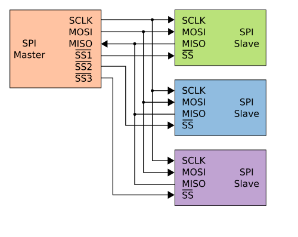
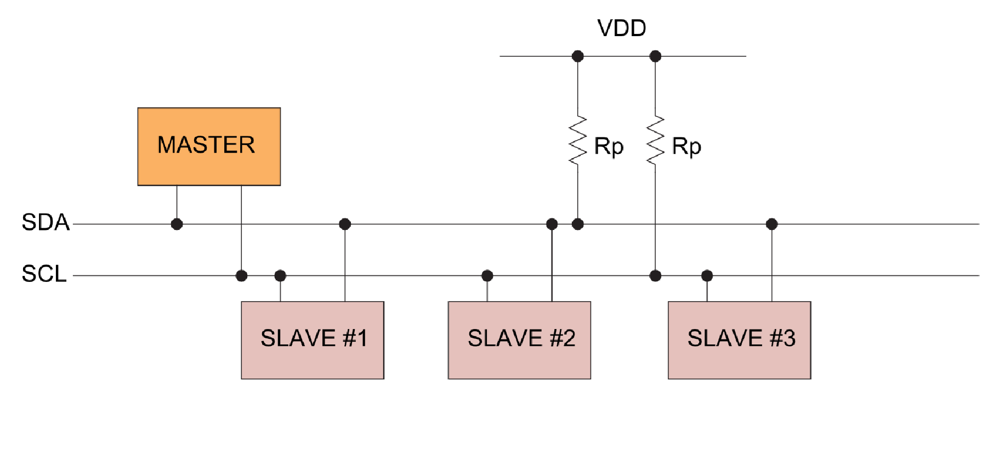

# 🚀 REV - Desáté cvičení - SPI a I2C

## SPI sběrnice:
SPI je základní rozhraní MCU pro komunikaci s obvody např. ADC, DAC, externí paměti apod. Jedná se o poměrně jednoduché rozhraní, které je synchronni master/slave. Obsahuje 3 komunikační vodiče clock, dataout a datain. K určení s kterým zařízením probíhá komunikace je zde další vodič pro každé zařízení. Nevýhodou pak může být velký počet vodičů a to, že veškerou komunikaci musí řídit master a také nemohou komunikovat obvody mezi sebou. Výhodou je jednoduchost a rychlost, která je běžně v  řádu MHz.  

## 
<p align="center">
  
</p>

## I2C sběrnice:
I2C je základní rozhraní MCU pro komunikaci s obvody např. senzory, EEPROM pamětmi, RTC obvody atd. Jedná se o synchronní sériové rozhraní typu master/slave, které používá pouze dva komunikační vodiče: hodinový signál SCL a datový vodič SDA. Výhodou je malý počet vodičů a možnost připojit více zařízení na stejnou sběrnici, přičemž každé zařízení má svoji adresu. Nevýhodou je nižší rychlost oproti SPI, složitější protokol a nutnost řešit adresaci, potvrzování přenosu a správné časování sběrnice. Komunikaci obvykle řídí master, který zahajuje přenos a určuje, se kterým zařízením bude komunikovat. Běžné rychlosti jsou například 100 kHz, 400 kHz, 1 MHz.

<p align="center">
  
</p>

## 🏗️ Přiklad 10.1:

<p align="center">
  
</p>

```c
#include <avr/io.h>
#include <avr/interrupt.h>
#include <stdio.h>
#include <stdbool.h>

#define F_CPU 24000000UL
#include <util/delay.h>

#include "w25qxx.h"

void uart_init(uint32_t f_cpu, uint32_t baud)
{
    PORTB.DIRSET = PIN0_bm;   
    PORTB.DIRCLR = PIN1_bm;   

    USART3.BAUD  = (uint16_t)((f_cpu * 4UL) / baud);        
    USART3.CTRLB |= USART_TXEN_bm;
}

void uart_write_byte(uint8_t c)
{
    while(!(USART3.STATUS & USART_DREIF_bm)){} 
    USART3.TXDATAL = c;
}

void spi_init(void) 
{
    // nastaveni pinu out
    PORTA.DIRSET = PIN4_bm | PIN6_bm | PIN7_bm;
    // nastaveni pinu in
    PORTA.DIRCLR = PIN5_bm;
    
    // mod 0, SSPIn disabled
    SPI0.CTRLB = SPI_SSD_bm | SPI_MODE_0_gc;

    // rezim master, nastaveni clk, enabled
    SPI0.CTRLA = SPI_MASTER_bm | SPI_PRESC_DIV16_gc | SPI_ENABLE_bm;
}

void CS_Select(bool active)
{
// je treba doplnit
}

uint8_t spi_transfer(uint8_t data) 
{
// je treba doplnit
}


uint8_t data[256];

int main(void) 
{
    
    _PROTECTED_WRITE(CLKCTRL_OSCHFCTRLA, CLKCTRL_FRQSEL_24M_gc);
    spi_init();
    uart_init(F_CPU, 115200);
    
    char msg[] = "Ahoj jak se vede";
    
    //W25Q_WritePage(256, (uint8_t*)msg, sizeof(msg));
    
    //while(W25Q_IsBusy());

    while (1) {

        for(uint8_t i=0; i<16; i++){
            uart_write_byte(data[i]);
            _delay_ms(10);
        }
                
        _delay_ms(1000);
        
    }
}
```

## 🏗️ Přiklad 10.2:

<p align="center">
  
</p>

```c
#include <avr/io.h>
#include <stdint.h>
#include <stdbool.h>
#include <stdio.h>
#include <math.h>
#define F_CPU 24000000UL
#include <util/delay.h>
#include "mpu6500.h"

void uart_init(uint32_t f_cpu, uint32_t baud)
{
    PORTB.DIRSET = PIN0_bm;   
    PORTB.DIRCLR = PIN1_bm;   
    USART3.BAUD  = (uint16_t)((f_cpu * 4UL) / baud);        
    USART3.CTRLB |= USART_TXEN_bm;
}

void uart_write_byte(uint8_t c)
{
    while(!(USART3.STATUS & USART_DREIF_bm)){} 
    USART3.TXDATAL = c;
}

void uart_write_str(const char *s)
{
    while(*s){
        uart_write_byte((uint8_t)*s++);
    }
}

void twi0_init(void)
{
    // baud 24e6/(2*400000) - (5 + (24e6 * 600e-9)/2)
    TWI0.MBAUD = 18;
    // zapnuti master mode
    TWI0.MCTRLA = TWI_ENABLE_bm;
    // stav sbernice idle 
    TWI0.MSTATUS = TWI_BUSSTATE_IDLE_gc;
}

bool twi0_wait_write(void)
{
    while (1)
    {
        if (TWI0.MSTATUS & (TWI_WIF_bm | TWI_RIF_bm))
        {
            return ((TWI0.MSTATUS & TWI_RXACK_bm) == 0);
        }

        if (TWI0.MSTATUS & (TWI_BUSERR_bm | TWI_ARBLOST_bm))
        {
            return false;
        }
    }
}

bool twi0_wait_read_ready(void)
{
    while (1)
    {
        if (TWI0.MSTATUS & TWI_RIF_bm)
        {
            return true;
        }

        if (TWI0.MSTATUS & (TWI_BUSERR_bm | TWI_ARBLOST_bm))
        {
            return false;
        }
    }
}

bool i2c_write_reg(uint8_t dev7, uint8_t reg, uint8_t value)
{
    TWI0.MADDR = (uint8_t)(dev7 << 1);   // Write
    if (!twi0_wait_write())
    {
        TWI0.MCTRLB = TWI_MCMD_STOP_gc;
        return false;
    }
    TWI0.MDATA = reg;
    if (!twi0_wait_write())
    {
        TWI0.MCTRLB = TWI_MCMD_STOP_gc;
        return false;
    }
    TWI0.MDATA = value;
    if (!twi0_wait_write())
    {
        TWI0.MCTRLB = TWI_MCMD_STOP_gc;
        return false;
    }
    TWI0.MCTRLB = TWI_MCMD_STOP_gc;
    return true;
}

bool i2c_read_regs(uint8_t dev7, uint8_t start_reg, uint8_t *buf, uint8_t len)
{
    // adresa
    TWI0.MADDR = (uint8_t)(dev7 << 1);  
    if (!twi0_wait_write())
    {
        TWI0.MCTRLB = TWI_MCMD_STOP_gc;
        return false;
    }
    // zapis registru
    TWI0.MDATA = start_reg;
    if (!twi0_wait_write())
    {
        TWI0.MCTRLB = TWI_MCMD_STOP_gc;
        return false;
    }
    // Repeated START
    TWI0.MADDR = (uint8_t)((dev7 << 1) | 0x01);
    if (!twi0_wait_write())
    {
        TWI0.MCTRLB = TWI_MCMD_STOP_gc;
        return false;
    }
    for (uint8_t i = 0; i < len; i++)
    {
        if (!twi0_wait_read_ready())
        {
            TWI0.MCTRLB = TWI_MCMD_STOP_gc;
            return false;
        }
        
        buf[i] = TWI0.MDATA;

        if (i == (len - 1))
        {
            // konec nack
            TWI0.MCTRLB = TWI_ACKACT_bm | TWI_MCMD_STOP_gc;
        }
        else
        {
            // pokracovat v recv
            TWI0.MCTRLB = TWI_MCMD_RECVTRANS_gc;
        }
    }
    
    return true;
}


int main(void)
{
    _PROTECTED_WRITE(CLKCTRL_OSCHFCTRLA, CLKCTRL_FRQSEL_24M_gc);
    
    twi0_init();
    uart_init(F_CPU, 115200);
    // zde je treba spravne inicializovat struct mpu6050_dev_t pro knihovnu
    mpu6050_dev_t  mpu_dev;
    mpu6050_raw_t imu;

    mpu6050_init(&mpu_dev);
    
    char text[32];
    
    while(1){
        if (mpu6050_read_raw(&mpu_dev, &imu))
        {
            int32_t x = ((int32_t)imu.ax);
            int32_t y = ((int32_t)imu.ay);
            int32_t z = ((int32_t)imu.az);
            
            sprintf(text, "%ld,%ld,%ld\r\n", x, y, z);
            uart_write_str(text);
        }
        _delay_ms(10);
    }
}
```

### 📝 Zadání:

  1) Vyzkoušejte zadání 10.1 a připojte ke kitu spi flash paměť w25q. Pro ovládání flash použíjte knihovnu. Knihovna vyžaduje implementovat funkce pro spi transfér a pro ovládání CS. 
  2) Rozšiřte knihovnu o funkci na mazání kompletní flash a take o funkci na vyčtení JEDEC ID (pro náš čip: 0xEF, 0x40, 0x16). (datasheet je zde ve složce na gitu) 
  3) Uložte do flash několik zpráv o 16 znacích pro displej. Pomocí tlačítka vždy vyčtěte data z flash a zobrazte zprávu na displej dokud nenarazíte na konec, kde se zase vraďte na začátek.  
  4) Vyzkoušejte zadání 10.2 a připojte ke kitu MPU6500(ACC,GYRO). Zahrňte do projektu knihovnu pro mpu. Zde je třeba poskytnou pointer na I2C funkce. Přepočítejte surová data na reálné jednotky. Využíjte seriový plot.    [serial plotter web](https://web-serial-plotter.atomic14.com/), [serial plotter app](https://github.com/hyOzd/serialplot/releases).
  5) Rozšiřte knihovnu tak, že bude možné nastavovat range pro ACC a pro GYRO. Například přidat argumenty do init funkce. (defaultní je +-2G a +-250deg/s). Vytvořte také funkci na čtení teploty. (datasheet je zde ve složce na gitu) 
  6) Zobrazujte hodnoty ACC a GYRA na displej a to tak, že MPU6500 přidáte na další I2C sběrnici TWI1 a displej necháte na současné. Piny lze vybrat v PORTMUX v datasheetu.
  7) Vytvořte program, který bude každých 10 ms ukládat data z ACC. Využíjte koncept double buffer(tedy do jednoho pole se ukládá a druhé se zapisuje, potom se prohodí), a ukládejte data do flash jako celý page write. Využíjte nějáký způsob časování s timerem tak, že data jsou opravdu čtena přesně každých 10ms.
