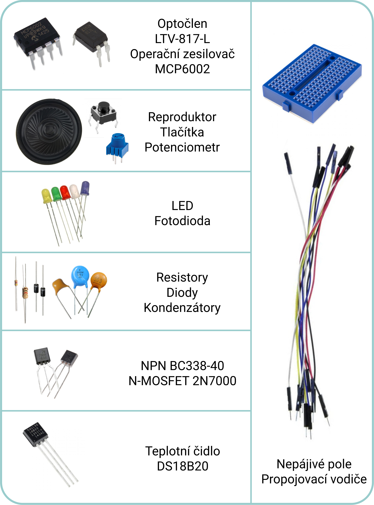
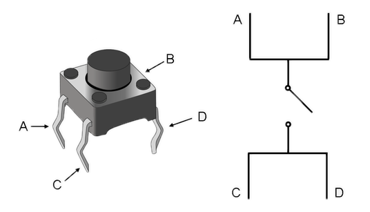
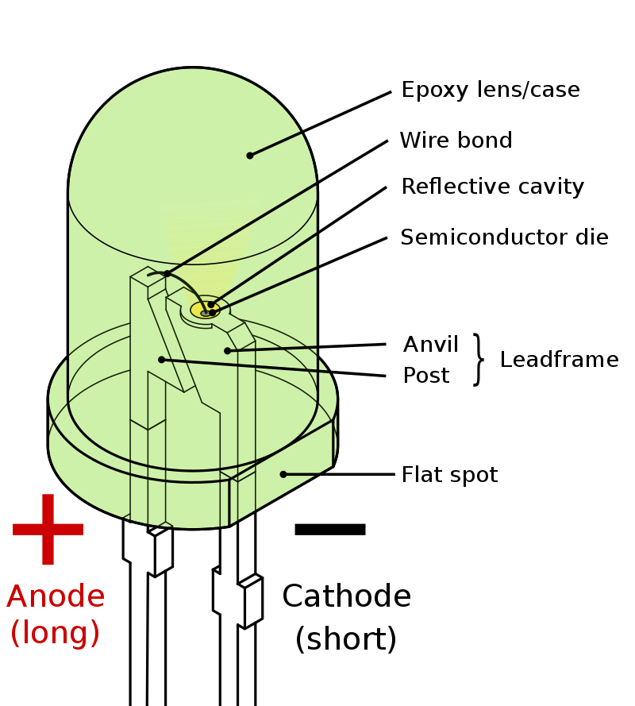
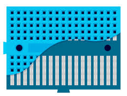

# REV - HW cvičení - Úvod

## Popis HW cvičení
Cílem doplňkových HW cvičení je seznámit studenty se základními elektronickými komponenty formou praktických úloh, na kterých si mohou sami vyzkoušet reálné využití právě probírané látky.

Cílem těchto cvičení není poskytnou detailní výklad dané problematiky, ale prakticky si sestavit vlastní elektrické obvody. Hlubší pochopení a vysvětlení poskytnou ostatní předměty během studia mechatroniky, případně si je zvídavý studující může sám dohledat.

## Obsah HWkitu

  

## Popis základních komponent

### Resistory
Sada vývodových metalických rezistorů s maximálním ztrátovým výkonem 0,25 W. Hodnota odporu je určena podle barevných proužků na povrchu rezistoru.

HWkit obsahuje rezistory následujících hodnot: 20R, 4k7, 10k, ... <mark>Upravit podle skutečnosti</mark>

### Potenciometr
Rotační potenciometr s odporem 10 kΩ. Prostřední vývod je připojen na jezdec potenciometru.

### Kondenzátory
Sada keramických nepolarizovaných (nezáleží na orientaci při zapojení) kondenzátorů. Hodnota kapacity je určena podle kódu na povrchu kondenzátoru.

HWkit obsahuje kondenzátory následujích hodnot: 1n, 100n, 1u, .... <mark>Upravit podle skutečnosti</mark>.

### Diody
Sada obsahuje Schottkyho diody SR240. Proužek na pouzdru diody indikuje katodu, tedy zápornou elektrodu.

### Tlačítka
Sada obsahuje mikrospínače typu NO (normally open). V pouzdru tlačítka jsou protilehlé kontakty vnitřně propojeny, při stlačení tlačítka se spojí sousední kontakty.

  

### LED
Sada obsahuje barevné LED diody. Tato dioda svítí pouze prochází-li jí proud v propustném směru, záleží tedy na její orientaci. LED musí být zapojena tak, že na její anodu se připojí kladné napětí a katodu záporné.

U THT LED lze orientaci poznat buď podle velikosti vývodů, kdy delší vývod bývá anoda. Případně lez poznat polaritu podle zkosení na pouzdře LED, kdy toto zkosení indikuje katodu. Oba tyto způsoby jsou znázorněné na obrázku níže. Výjimkou jsou RGB a podobné diody, které mají více vývodů. Zde je nutné polaritu zjistit z datasheetu.

  

### Nepájivé pole (breadboard)
Nepájivé pole umožňuje rozebíratelné propojení jednotlivých komponent bez nutnosti jejich pájení. Komponenty se umísťují do jednotlivých děr. Tyto díry jsou vzájemně propojeny po jednotlivých řádcích, jak je zobrazeno na obrázku níže. Jednotlivé řádky na levé a pravé straně nejsou spolu propojeny.

  

