# REV - HW cvičení - GPIO

## Úloha 1: Pull-up, pull-down rezistory

### Zadání
Naprogramujte REVkit tak, aby digitální pin RB4 snímal stav připojeného tlačítka a podle něj spínal LED1 na REVkitu. Pokud je tlačítko sepnuté LED svítí a opačně.

### Rozbor
Digitální vstupy integrovaných obvodů dávají na svém výstupu logickou hodnotu 0 nebo 1. Těmto hodnotám odpovídá určité rozmezí vstupních napětí. Pro náš mikrokontrolér je logická 0 do 0,8 V a logická 1 od 2 V (viz kapitola 27.8 v datasheetu našeho MCU). Mimo tato rozmezí není hodnota definována a může nabývat libovolný stav.

V případě, že digitální vstup není k ničemu připojen, je takzvaně plovoucí (*floating*). Nemůžeme určit, jaká bude hodnota napětí na tomto pinu a může být snadno ovlivněn rušením z okolí, od sousedních pinů atd. Digitální hodnota vstupu tedy může nabývat náhodné hodnoty podle okolních podmínek.

```
Sami si nyní vyzkoušejte, co se stane, pokud naprogramuje mikrokontrolér tak, že hodnotu na digitálním vstupu RB4, budete přímo zapisovat na pin ovládající LED1.
Uvidíte, že i dotek prstu na pin RB4 můžete měnit stav LED1.
```

Pro správnou funkci je tedy nutné, aby na digitálním vstupu bylo neustále definované napětí.

### Zapojení
Z předchozího rozboru víme, že na digitálním vstupu musíme mít neustále nějakou definovanou hodnotu napětí. Při spínání tlačítka chceme rozlišit stav sepnuto a rozpojeno, musíme mít tedy dvě úrovně napětí.

Mohlo by vás napadnout použít zapojení zobrazené na obrázku níže. Pokud je tlačítko rozpojené, tak bychom měli na digitálním pinu 3,3 V tedy logickou jedničku a pokud je sepnuté, tak by byl pin spojený přes tlačítko do země, tedy 0 V a logická 0. Toto zapojení, je ale **CHYBNÉ**, jelikož při sepnutí tlačítka dojde zároveň ke zkratu mezi 3,3V a GND.

<p align="center">
  
</p>

Správné zapojení je zobrazeno níže na obrázku v levo, kdy je použit takzvaný *pull-up* (je spojen s napájecím napětím) rezistor mezi pinem RB4 a 3.3V. Tento rezistor nám omezuje proud tekoucí mezi 3,3 V a GND, pokud je tlačítko sepnuté. Obdobné zapojení je zobrazeno na schématu níže v pravo, kdy tlačítko připojuje na pin napětí 3,3 V a je zde použit *pull-down* (je spojen se zemí) rezistor mezi pinem a GND. V tomto případě budeme na digitálním pinu číst nulu v případě, že je tlačítko rozepnuté.

<p align="center">
  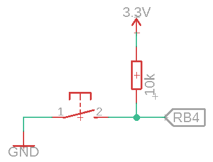
  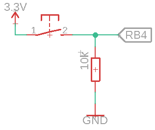
</p>

Hodnotu pull-up/down rezistoru volíme zpravidla od 1 kΩ do 100 kΩ v závislosti na kapacitě cesty, frekvenci signálu, požadavcích na spotřebu a dalších vlivech. V našich aplikacích budeme používat hodnotu 10 kΩ.

Princip zapojení jednotlivých komponent na nepájivé pole pro variantu pull-up je na obrázku níže. 

<p align="center">
  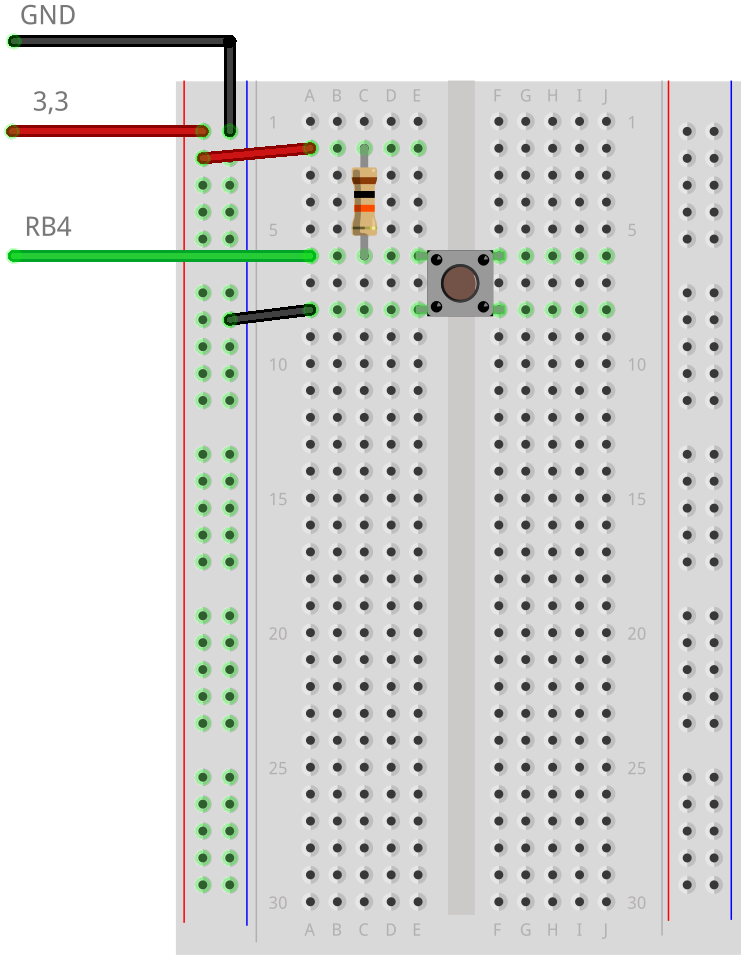
</p>

## Úloha 2: Využití interních pull-up rezistorů mikrokontroléru

### Zadání
Místo použití externích pull-up rezistorů, zkuste využít interní pull-up rezistory, které jsou dostupné pro všechny piny z PORTB k vyřešení úlohy 1.

### Rozbor
Mikrokontrolér použitý na REVkitu umožňuje využít interní slabé pull-up rezistory na všech pinech z PORTB a pinu RE3. Tím nám odpadne nutnost použít externí pull-up rezistory. Nicméně vnitřní pull-upy nemusí být vhodné pro každou aplikaci.

Zkuste si vnitřní pull-up rezistory na pinu RB4 nastavit sami dle sekce 10.3.1 z datasheetu.

### Zapojení
Oproti zapojení z předchozího příkaldu již není nutné používat externí pull-up rezistor. K zapojení tlačítka nám tedy postačí GND a signál do pinu RB4.

## Úloha 3: Debouncing tlačítka

### Zadání
Naprogramujte REVkit tak, aby digitální vstup RB4 snímal stav připojeného tlačítka a při každém stlačení tlačítka měnil stav LED2 na REVkitu. První stlačení rozsvítí LED, druhé stlačení ji zhasne, třetí zase rozsvítí a tak dále.

### Rozbor
Pokud implementujete algoritmus ze zadání a použijete zapojení z úkolu 1, tak zjistíte, že občas LED bude reagovat nejen na stlačení, ale i na uvolnění tlačítka, případně dojde pouze k jejímu probliknutí. Tento jev je způsoben mechanickými odskoky kontaktů tlačítka (*bouncing*) při jeho stlačení a uvolnění, průběh napětí při tomto jevu je zobrazen na obrázku níže. Jednotlivé změny napětí způsobují změnu logické hodnoty, kterou čteme na digitálním pinu a tedy i změnu stavu LED.

<p align="center">
  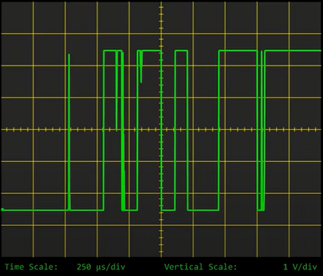
</p>

Debouncing tlačítek se může řešit buď programově, pomocí pauzy, přerušením nebo hardwarově.

Častým řešením je použití RC filtru za výstupem tlačítka. Tento filtr nám pomůže odfiltrovat přechodový děj, jak lze vidět na obrázku níže. Výsledný signál má nyní exponenciální náběžnou i sestupnou hranu, a navíc i v tomto signálu může docházet ke kolísání hodnoty, která může způsobit chybnou detekci sepnutí. Ideálním řešením je použití integrovaného obvodu s hysterezí na vstupu, třeba Schmittův klopný obvod (*Schmitt trigger*). Tím získáme signál, který má ostré hrany bez jakéhokoliv přechodového děje.

<p align="center">
  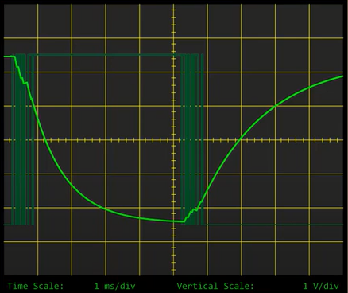
</p>

### Zapojení
Pro debouncing použijeme zmíněný RC filtr podle zapojení na obrázku XX. Časová konstanta filtru nemůže být příliš malá, jinak by nemuselo dojít ke správnému odfiltrování přechodového děje. Na druhou stranu nemůže být ani příliš velká, aby nedošlo k přílišnému zpoždění signálu nebo nezaznamenání krátkých stisků tlačítka.

Přechodový děj může obvykle trvat od 100 us až po jednotky milisekund. Časovou konstantu filtru (R ∙ C) tedy budeme volit kolem hodnoty 1 ms. Obvyklá kombinace bývá 1 kΩ a 1µF. Tyto hodnoty se vždy musí přizpůsobit konkrétnímu obvodu.

<p align="center">
  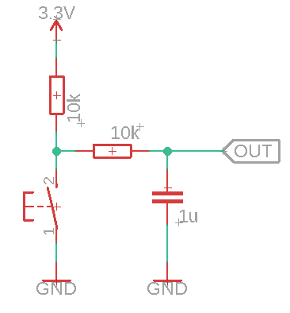
</p>

## Úloha 4: Zapojení externí LED

### Zadání
Naprogramujte REVkit tak, aby digitální vstup RB4 snímal stav připojeného tlačítka podle něj spínal externí LED připojenou k pinu RB5.

### Rozbor
Jelikož LED je ve své podstatě dioda, tak nás budou u ní zajímat stejné parametry jako u ostatních diod a to konkrétně tyto:

1. Napětí v propustném směru V<sub>F</sub>, U<sub>F</sub> (*forward voltage*)
    - Jedná se o úbytek napětí na diodě.
    - Bývá specifikováno v datasheetu z pravidla jako rozsah napětí pro nominální proud diodou I<sub>F</sub>
    - Hodnoty tohoto napětí se liší podle typu PN přechodu diody, tedy podle vyzařovaného světla
        - IR: 1,6 V
        - Červená: 2,1 V
        - Zelená: 2,6 V
        - Modrá: 3 V
2. Proud v propustném směru I<sub>F</sub> (*forward current*)
    - Bývá udáván jako maximální hodnota proudu, který může diodou procházet.
    - Při překročení této hodnoty dochází k poškození diody.

Závislost těchto dvou veličin bývá specifikována v datasheetu, jak je vidět na obrázku níže.

<p align="center">
  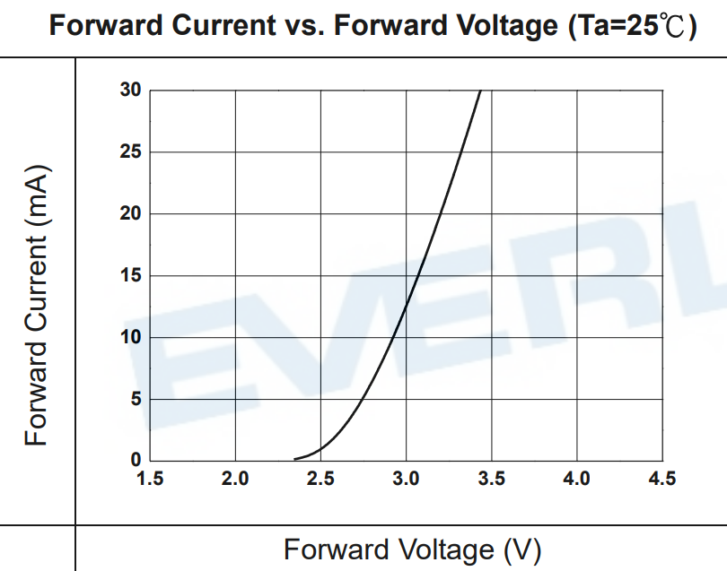
</p>

### Zapojení
Z rozboru víme, jaké parametry LED jsou pro návrh obvodu na obrázku níže důležité a v datasheetu si můžeme dohledat konkrétní hodnoty U<sub>F</sub> a I<sub>F</sub> pro naši diodu. Na základě znalostí těchto hodnot, hodnoty napájecího napětí U a Ohmova zákona můžeme určit hodnotu rezistoru zapojeného do série s LED následově:

<p align="center">
    
</p>

<p align="center">
  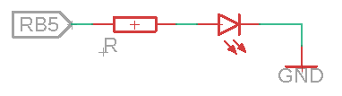
</p>

## Úloha 5: Spínání LED pomocí NPN tranzistoru

### Zadání
Naprogramujte REVkit tak, aby digitální vstup RB4 snímal stav připojeného tlačítka a podle něj spínal externí LED pomocí bipolárního NPN tranzistoru spínaného pinem RB5.

### Rozbor
NPN tranzistor je bipolární tranzistor, kdy NPN vyjadřuje vnitřní polovodičovou strukturu, která je zobrazena spolu se značkou tranzistoru na obrázku níže. Ze struktury vidíme, že se v tranzistoru nachází dva PN přechody, tedy v podstatě dvě diody zapojené proti sobě v sérii.

<p align="center">
  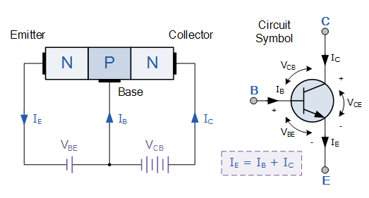
</p>

Tranzistor má tři vývody odznačované jako **B**-báze, **C**-kolektor a **E**-emitor. Báze je řídicí elektroda, kdy proud bází ovlivňuje velikost proudu protékajícího mezi kolektorem a emitorem.

V další části si popíšeme, jak volit tranzistor a jeho zapojení v případě, že jej chceme používat jako spínač.

Pokud chceme tranzistor používat jako spínač, musíme jej provozovat v takzvaném pásmu saturace, které je zobrazeno na výstupní charakteristice na obrázku dole.

<p align="center">
  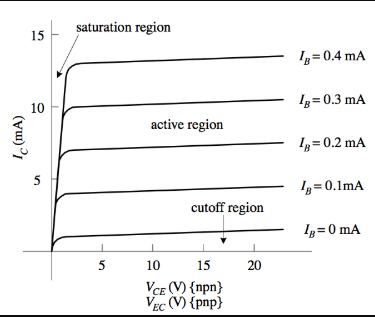
</p>

V tomto pásmu vidíme, že má tranzistor téměř lineární závislost mezi V<sub>CE</sub> a I<sub>C</sub>, chová se tedy jako odpor a má nejmenší ztráty. Pásmo saturace se nazývá proto, že nehledě na zvyšování I<sub>B</sub>, tak proud I<sub>C</sub> již dále neporoste.

Další charakteristika důležitá pro pochopení fungování tranzistoru je vstupní charakteristika zobrazená na obrázku dole. Tato charakteristika má stejný tvar, jako V-A charakteristika diody v propustném směru (viz předchozí úloha). To, že se tranzistor chová mezi B a E jako dioda je vidět i z obrázku zobrazujícího strukturu tranzistoru. Z této charakteristiky plyne, že aby tranzistor mohl vést elektrický proud, musí být napětí mezi B a E alespoň 0,7 V.

<p align="center">
  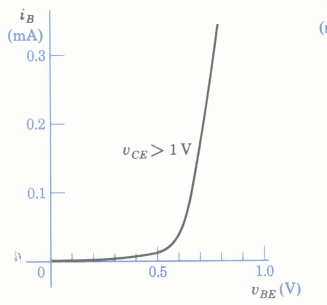
</p>

Z charakteristik tedy vidíme, že jediné, jak můžeme tranzistor ovládat, je velikost proudu bází, za podmínky, že napětí mezi bází a emitorem je vyšší, než 0,7 V.

Pokud tranzistor není saturován, tak velikost protékajícího proudu mezi kolektorem a emitorem je přímo úměrná velikosti proudu tekoucího do báze. Konstantou úměrnosti je zesilovací činitel označovaný jako h<sub>FE</sub> (*DC current gain*).

Každý tranzistor má samozřejmě svá omezení na maximální proudy a napětí, které je schopen zvládnout.

### Zapojení

Z rozboru výše víme, že pro správné spínání tranzistoru musíme vhodně zvolit proud bází I<sub>B</sub> a tedy rezistor, který nám tento proud zajistí. K tomu ještě musíme znát maximální proud I<sub>C</sub>. Hodnotu I<sub>B</sub> můžeme buď zjistit z výstupní charakteristiky nebo výpočtem, kdy vyjdeme ze závislosti mezi h<sub>FE</sub> = I<sub>C</sub>/I<sub>B</sub>. Hodnotu h<sub>FE</sub> najdeme v datasheetu a použijeme její minimální hodnotu, tím získáme proud I<sub>B</sub>. Následně u výpočtu hodnoty odporu použijeme hodnotu napětí na našem řídicím pinu od které musíme odečíst hodnotu úbytku napětí na přechodu mezi B a E.


**Příklad:**

Chceme spínat proud 150 mA, hFE je 50 a spínací signál má maximální hodnotu 5 V.

<p align="center">

</p>

Abychom si byli jisti, že je tranzistor plně sepnut, zvýšíme hodnotu požadovaného IB na dvojnásobek, tedy 6 mA. Potom RB bude:

<p align="center">

</p>

Pro hodnotu bázového odporu tedy použijeme nejbližší nižší standardní hodnotu rezistoru.

Pro zapojení tranzistoru existuje řada možností, my zde použijeme zapojení se společným emitorem (*common emmitor*), které je nejběžnější.

<p align="center">
  
</p>

## Úloha 6: Spínání LED pomocí N-MOSFET

### Zadání
Naprogramujte REVkit tak, aby digitální vstup RB4 snímal stav připojeného tlačítka a podle něj spínal externí LED pomocí bipolárního N-MOSFET spínaného pinem RB5.

### Rozbor
MOSFET je moderní nástupce bipolárního tranzistoru. Hlavním rozdílem oproti svému předchůdci je to, že velikost protékajícího proudu přes tranzistor není závislá na proudu přiváděného na řídicí pin, ale na napětí. Schematická značka i značení elektrod je odlišné od bipolárního tranzistoru, jak je ukázáno na obrázku dole.

<p align="center">
  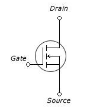
</p>

Podmínkou k tomu, aby N-MOSFET vedl elektrický proud mezi I<sub>D</sub> mezi D a S, je ta, aby napětí mezi G a S bylo větší, než prahové napětí V<sub>GS(th)</sub> uváděné v datasheetu. My budeme opět používat tranzistor jako spínač, budeme se tedy chtít pohybovat v Ohmické části charakteristiky na obrázku dole. Zde vidíme, jakému napětí V<sub>GS</sub> a proudu I<sub>D</sub> odpovídá úbytek napětí na tranzistoru V<sub>DS</sub>. Cílem je dosáhnout co nejnižšího V<sub>DS</sub> a tedy i nejnižších ztrát.

Každý tranzistor má samozřejmě svá omezení na maximální proudy a napětí, které je schopen zvládnout

### Zapojení
Tím, že je N-MOSFET spínán pouze napětím, nebudeme v našem obvodu potřebovat sériový rezistor u G. Nicméně, budeme zde potřebovat pull-down rezistor, tento rezistor nám zajistí, že gate tranzistoru bude mít nulový potenciál i v případě, že není připojen řídicí signál a nedojde k nechtěnému sepnutí tranzistoru.

```
Sami si vyzkoušejte, že pokud odpojíte řídicí signál na gate i pull-down rezistor, tak můžete sepnout tranzistor pouze dotekem prstu.
```

Výsledné schéma zapojení tranzistoru je na obrázku níže.

<p align="center">
  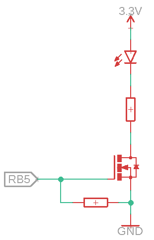
</p>

```
Zkuste měnit velikost napětí spínacího signálu tranzistoru z pinu RB5 pomocí potenciometru. Jaký to bude mít vliv?
```

## Úloha 7: Spínání LED přes optočlen

### Zadání
Naprogramujte REVkit tak, aby digitální vstup RB4 snímal stav připojeného tlačítka a podle něj spínal přes optočlen připojenou LED pomocí pinu RB5.

### Rozbor
Optočlen je elektronická součástka sloužící ke galvanickému oddělení obvodů. Skládá se z LED na vstupu a fotodetektoru na výstupu (typicky fototranzistoru), mezi kterými je izolační vrstva. Optočleny se používají pro přenos analogového nebo digitálního signálu, a to pouze jedním směrem.

Jelikož se optočlen skládá ze dvou komponent, jejichž zapojení a použití jsme si už ukázali, viz schematický symbol optočlenu níže. Měli byste být již sami schopni na základě datasheetu výsledný obvod sestavit.

<p align="center">
  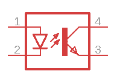
</p>

Pro detailnější pochopení optočlenů doporučuji následující odkaz: [www]( https://www.edn.com/guidelines-for-reading-an-optocoupler-datasheet/)