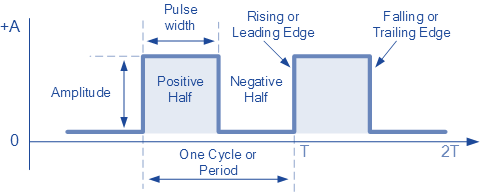
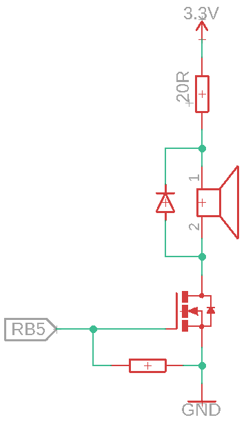

# REV - HW cvičení - Timer a ISR

## Úloha 1: Zahrajme si komorní A

### Zadání
Naprogramujte REVkit tak, aby připojený reproduktor spínaný tranzistorem hrál komorní A (440 Hz).

### Rozbor
K vygenerování tónu o frekvenci 440 Hz použijeme reproduktor z HW sady. Reproduktor slouží k přeměně elektrické energie na energii mechanickou. Je tvořen membránou spojenou s cívkou a pevně umístěným magnetem. Při průchodu elektrického proudu cívkou vzniká magnetické pole, které cívku přitahuje nebo odpuzuje od magnetu a tím dochází i k pohybu membrány. Tento pohyb způsobuje změny tlaku v okolním vzduchu, které vnímáme jako zvuk.

Aby reproduktor produkoval zvuk o frekvenci 440 Hz musí se membrána reproduktoru pohybovat s touto frekvencí. Našim cílem tedy bude vygenerovat právě takový signál.

Nejjednodušší signál, který můžeme vygenerovat je čtvercový signál. Tento signál má pouze dvě úrovně a doba trvání každé úrovně je polovina periody, jak je ukázáno na obrázku níže. Poměr doby, kdy je signál v horní úrovni ku periodě signálu se označuje jako *střída* (*duty cycle*).

<p align="center">
  
</p>

Vašim úkolem je pomocí timeru a přerušení vygenerovat čtvercový signál s frekvencí 440 Hz. Tento signál následně použijeme ke spínání tranzistoru.

### Zapojení
Jelikož je reproduktor v podstatě cívka, je nutné brát zřetel na jeho zapojení, jinak může dojít k poškození komponent!

Musíme si dát pozor na dvě věci: impedanci cívky a indukované napětí při jejím spínání (*back EMF*)

Impedance cívky v našem reproduktoru je 8 Ω. Při připojení k napětí 3,3 V to odpovídá proudu 412 mA. To je jednak důvod proč nemůžeme spínat cívku přímo digitálním pinem (protože by to proudově nezvládl) a dále je tato hodnota příliš velká i pro samotný linerání regulátor použitý na REVkitu, musíme proto protékající proud omezit vhodným sériovým rezistorem. Ve vaší sadě se nachází rezistor s hodnotou 20 Ω, který k tomu použijte.

Dalším důvodem, proč je nutné být opatrný při spínání jakékoliv induktivní zátěže (elektromotor, relé, reproduktor, ale i dlouhé vodiče) je indukované napětí způsobené změnou procházejícího proudu cívkou. Při sepnutí nám toto napětí pouze způsobí exponencionální nárůst proudu cívkou, nicméně při vypnutí dojde k náhlé změně proudu a tedy i k velkému nárůstu indukovaného napětí. Dle indukčnosti cívky může toto indukované napětí dosáhnout až stovek voltů, které mohou zničit použitý tranzistor. Nejběžnějším řešením je zapojit paralelně s cívkou nulovou diodu (*flywheel diode*), která umožní, aby i po vypnutí tranzistoru mohl proudit proud cívkou a nedošlo k poškození tranzistoru.

Výsledné schéma je na obrázku níže.

<p align="center">
  
</p>

```
Jakými způsoby můžeme ovlivnit hlasitost reproduktoru?

Pokud bychom chtěli k ovládání hlasitosti použít potenciometr, je lepší ho dát před gate mosfetu nebo před reproduktor?
```

## Úloha 2: Přehrajte si písničku na REVkitu

### Zadání
S využitím znalostí z předchozí úlohy si přehrajte písničku zakódovanou v souboru "notes.h". V tomto souboru máte definovány makra pro jednotlivé tóny skladby a jejich odpovídající frekvenci. Následně zde máte definováno pole, které obsahuje za sebou jdoucí dvojce tón a jeho délka. 

Pokud je délka tónu kladná, tak 1 znamená nota celá, 2 nota půlová, 4 nota čtvrťová atd. Záporná hodnota je tečkovaná nota, tedy nota prodloužená o polovinu své délky, nota půlová nebude trvat půl doby, ale tři čtvrtiny doby.

Nota s označením REST znamená pauzu. Délka pauzy je opět vyjádřena číslem.

Dobu trvání celé noty zvolte 1,6 s.

### Rozbor
Stejně jako v předchozím příkladě, použijeme timer ke generování čtvercového signálu s frekvencí, která bude odpovídat jednotlivým notám. Zároveň použijte druhý timer, který bude odměřovat délku jednotlivých not.

### Zapojení
Zapojení je shodné s předchozí úlohou.


## Úloha 3: Interrupt on Change

### Zadání
Mikrokontrolér na REVkitu umožňuje vyvolat přerušení nejen na přetečení časovače, ale také na změnu stavu digitálního pinu. Tato funkcionalita je k dispozici pro některé piny z PORTB.

Najděte si v datasheetu potřebnou kapitolu týkající se této problematiky a zkuste implementovat interrupt na změnu stavu externího tlačítka. V interruptu měňte stav LED1.

### Rozbor
Ne všechny piny podporují IoC. Zároveň zkuste při připojení tlačítka využít i interních pull-up rezistorů.

Dejte si pozor na podmínky, za jakých je možné smazat příznak přerušení.